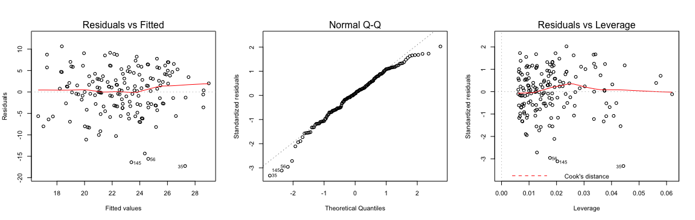

# R basics

- assign a value:
```R
something <- value
```

- add comment
```R
# some_comment (just like python)
```

- execute a line of code (just like debug mode but not entirely the same)
```R
Cmd/ctrl + Enter
```

- basic arithmetics
```R
+ # Addition
- # Subtraction
* # Multiplication
/ # Division
^ (or **) # Exponentiation
```

- excecute a function
```R
some_function(object)
```

- take mean value
```R
mean(data_source)
```

- access first a lines of dataframe
```R
head(students2014, n = a)
# its a good practice to add the argument name to avoid confusion
```


- structure of data
```R
str(data_source)
# but in python it prints out string of an object
```

- data types: numeric, characters, logical, factor(new concept conpared to python)
```R
"Strongly disagree" = 1
"Strongly agree" = 5
```

```R
# Boolean values: TRUE or FALSE 
# all upper case
```

- create a vactor
```R
c(2, 3, 4.1, 5) # has to be same data type

```


- summary of the data
```R
summary(data source)
# it will return some important statistical value of the selected data
```

- plot a scatter figure
```R
plot(x, y, "p", main = "some title")
```

- manupulate a value of a vector
```R
names[1]
# start at 1 not 0
names[1] <- "new_value"
names[c(1, 3)] # select value from these positions, order matters
```


- create a integer vector
```R
c[1, 2, 3, 4, 5]
1:5

# manupulate the vector
(1:5)*2

# length of the data
length(data)

slicing
data[begin:end]
# possible to modify the vector when slicing a dataframe
```

- logical comparison

```R
==	# exactly equal to
!=	# not equal to
<	# less than
>	# greater than
<=	# less or equal to
>=	# greater or equal to
!a	# NOT a
a & b	# a AND b
a | b	# a OR b
```

- take sebset of the dataframe
```R
subset(data_source, conditions...)

```

- looping
```R
for (counter in vector) {
  commands
  more commands
}
```
- access a library
```R


- create functions
```R
function_name <- function(arg1, arg2 = 5) return(return_value) # arg = default value
```


```R
varible <- read.table("source_of data", sep="\t", header=TRUE) # read data
dim(data) # check dimension
str(data) # check structure
colSums(df)	# returns a sum of each column in df
rowSums(df)	# returns a sum of each row in df
colMeans(df)	# returns the mean of each column in df
rowMeans(df) # return the mean of each row in df
select(dataframe, one_of(columes)) # select columns to create new datafram
colnames(data)[columm_index] <- "new_name" # modify column names
filtered_data <- filter(original_data, conditions) # filter the data with conditions

# If-else statement
if(condition) {
   do something
} else {
   do something else
}

c(1,2,3,4,5) / 2 # scaling vectors

%>% # pipe operator


select(data_source, one_of(vector_of_columns)) # select few columns as new one

colnames(data) # print colunm names

data_frame <- as.data.frame(scaled) # change data to data frame

sample() # choose ramdom data

mutate() # adding new variables as mutations of the existing ones

jointed_data <- inner_join(first_data, second_data, by = common_columns, suffix = c(".first", ".second"))

```

# Regression and model validation
## Linear regression
```R
library(ggplot2)

qplot(target_variable, explanatory_variable, data = data_source) + geom_smooth(method = "lm") # print out linear fit line
lm(target_variable ~ explanatory_variable + another_one, data = data_source)
predict(m, newdata = new_data) # makeing presidction with new_data
```


## Graphical model validation

```R
# create a regression model with multiple explanatory variables
my_model2 <- lm(points ~ attitude + stra, data = learning2014)

# draw diagnostic plots using the plot() function. Choose the plots 1, 2 and 5
par(mfrow = c(2,2))
plot(my_model2, which = c(1,2,5))
```


## Making predictions
```R
# Create model object m
m <- lm(points ~ attitude, data = learning2014)

# New observations
new_attitudes <- c("Mia" = 3.8, "Mike"= 4.4, "Riikka" = 2.2, "Pekka" = 2.9)
new_data <- data.frame(attitude = new_attitudes)

# Predict the new students exam points based on attitude
predict(m, newdata = new_data)
```
Prediction:
```R
     Mia     Mike   Riikka    Pekka 
25.03390 27.14918 19.39317 21.86099
```

# Logistic regression


# Clustering and classification

Classification:

- Known data
- Traind based on data
- Classify new observations

Clustering:

- Unknown data
- Find groups with data based on similarity

Methods

- Linear descriminant analysis
- Distance measures
- K-means

# Dimensionality reduction techniques

# Analysis of longitudinal data


