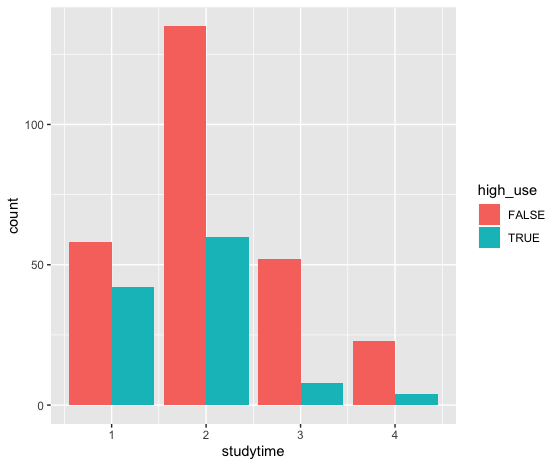

# 3. Alcohol Consumption Analysis
## 3.1 Introduction
## 3.2 Overview of the Data
```R
alc <- as.data.frame(read.table('data/alc.csv',  sep="\t", header=TRUE))
glimpse(alc)
```
Results:
```
Observations: 382
Variables: 35
$ school     <fct> GP, GP, GP, GP, GP, GP, GP, GP, GP, GP, GP, GP, GP, GP, GP, GP, GP, GP, GP, GP, GP, GP, G…
$ sex        <fct> F, F, F, F, F, M, M, F, M, M, F, F, M, M, M, F, F, F, M, M, M, M, M, M, F, F, M, M, M, M,…
$ age        <int> 18, 17, 15, 15, 16, 16, 16, 17, 15, 15, 15, 15, 15, 15, 15, 16, 16, 16, 17, 16, 15, 15, 1…
$ address    <fct> U, U, U, U, U, U, U, U, U, U, U, U, U, U, U, U, U, U, U, U, U, U, U, U, R, U, U, U, U, U,…
$ famsize    <fct> GT3, GT3, LE3, GT3, GT3, LE3, LE3, GT3, LE3, GT3, GT3, GT3, LE3, GT3, GT3, GT3, GT3, GT3,…
$ Pstatus    <fct> A, T, T, T, T, T, T, A, A, T, T, T, T, T, A, T, T, T, T, T, T, T, T, T, T, T, T, T, A, T,…
$ Medu       <int> 4, 1, 1, 4, 3, 4, 2, 4, 3, 3, 4, 2, 4, 4, 2, 4, 4, 3, 3, 4, 4, 4, 4, 2, 2, 2, 2, 4, 3, 4,…
$ Fedu       <int> 4, 1, 1, 2, 3, 3, 2, 4, 2, 4, 4, 1, 4, 3, 2, 4, 4, 3, 2, 3, 3, 4, 2, 2, 4, 2, 2, 2, 4, 4,…
$ Mjob       <fct> at_home, at_home, at_home, health, other, services, other, other, services, other, teache…
$ Fjob       <fct> teacher, other, other, services, other, other, other, teacher, other, other, health, othe…
$ reason     <fct> course, course, other, home, home, reputation, home, home, home, home, reputation, reputa…
$ nursery    <fct> yes, no, yes, yes, yes, yes, yes, yes, yes, yes, yes, yes, yes, yes, yes, yes, yes, yes, …
$ internet   <fct> no, yes, yes, yes, no, yes, yes, no, yes, yes, yes, yes, yes, yes, yes, yes, yes, no, yes…
$ guardian   <fct> mother, father, mother, mother, father, mother, mother, mother, mother, mother, mother, f…
$ traveltime <int> 2, 1, 1, 1, 1, 1, 1, 2, 1, 1, 1, 3, 1, 2, 1, 1, 1, 3, 1, 1, 1, 1, 1, 2, 1, 1, 1, 1, 1, 1,…
$ studytime  <int> 2, 2, 2, 3, 2, 2, 2, 2, 2, 2, 2, 3, 1, 2, 3, 1, 3, 2, 1, 1, 2, 1, 2, 2, 3, 1, 1, 1, 2, 2,…
$ failures   <int> 0, 0, 2, 0, 0, 0, 0, 0, 0, 0, 0, 0, 0, 0, 0, 0, 0, 0, 3, 0, 0, 0, 0, 0, 0, 1, 0, 0, 0, 0,…
$ schoolsup  <fct> yes, no, yes, no, no, no, no, yes, no, no, no, no, no, no, no, no, no, yes, no, no, no, n…
$ famsup     <fct> no, yes, no, yes, yes, yes, no, yes, yes, yes, yes, yes, yes, yes, yes, yes, yes, yes, ye…
$ paid       <fct> no, no, yes, yes, yes, yes, no, no, yes, yes, yes, no, yes, yes, no, no, yes, no, no, yes…
$ activities <fct> no, no, no, yes, no, yes, no, no, no, yes, no, yes, yes, no, no, no, yes, yes, yes, yes, …
$ higher     <fct> yes, yes, yes, yes, yes, yes, yes, yes, yes, yes, yes, yes, yes, yes, yes, yes, yes, yes,…
$ romantic   <fct> no, no, no, yes, no, no, no, no, no, no, no, no, no, no, yes, no, no, no, no, no, no, no,…
$ famrel     <int> 4, 5, 4, 3, 4, 5, 4, 4, 4, 5, 3, 5, 4, 5, 4, 4, 3, 5, 5, 3, 4, 5, 4, 5, 4, 1, 4, 2, 5, 4,…
$ freetime   <int> 3, 3, 3, 2, 3, 4, 4, 1, 2, 5, 3, 2, 3, 4, 5, 4, 2, 3, 5, 1, 4, 4, 5, 4, 3, 2, 2, 2, 3, 4,…
$ goout      <int> 4, 3, 2, 2, 2, 2, 4, 4, 2, 1, 3, 2, 3, 3, 2, 4, 3, 2, 5, 3, 1, 2, 1, 4, 2, 2, 2, 4, 3, 5,…
$ Dalc       <int> 1, 1, 2, 1, 1, 1, 1, 1, 1, 1, 1, 1, 1, 1, 1, 1, 1, 1, 2, 1, 1, 1, 1, 2, 1, 1, 1, 2, 1, 5,…
$ Walc       <int> 1, 1, 3, 1, 2, 2, 1, 1, 1, 1, 2, 1, 3, 2, 1, 2, 2, 1, 4, 3, 1, 1, 3, 4, 1, 3, 2, 4, 1, 5,…
$ health     <int> 3, 3, 3, 5, 5, 5, 3, 1, 1, 5, 2, 4, 5, 3, 3, 2, 2, 4, 5, 5, 1, 5, 5, 5, 5, 5, 5, 1, 5, 5,…
$ absences   <int> 5, 3, 8, 1, 2, 8, 0, 4, 0, 0, 1, 2, 1, 1, 0, 5, 8, 3, 9, 5, 0, 0, 1, 1, 2, 10, 5, 2, 3, 1…
$ G1         <int> 2, 7, 10, 14, 8, 14, 12, 8, 16, 13, 12, 10, 13, 11, 14, 16, 13, 10, 7, 10, 12, 12, 14, 12…
$ G2         <int> 8, 8, 10, 14, 12, 14, 12, 9, 17, 14, 11, 12, 14, 11, 15, 16, 14, 12, 6, 11, 14, 14, 14, 1…
$ G3         <int> 8, 8, 11, 14, 12, 14, 12, 10, 18, 14, 12, 12, 13, 12, 16, 16, 14, 12, 6, 11, 14, 14, 15, …
$ alc_use    <dbl> 1.0, 1.0, 2.5, 1.0, 1.5, 1.5, 1.0, 1.0, 1.0, 1.0, 1.5, 1.0, 2.0, 1.5, 1.0, 1.5, 1.5, 1.0,…
$ high_use   <lgl> FALSE, FALSE, TRUE, FALSE, FALSE, FALSE, FALSE, FALSE, FALSE, FALSE, FALSE, FALSE, FALSE,…
```


## 3.3 Purpose of the Analysis
I’ve chosen the following 4 variables that I assume are indicative of students’ alcohol consumption:

- Final grade (variable G3). My assumption is that who got lower grade drink more.
- Failures (variable failures). My assumption is that who fails more drink more.
- Absence of lessons (variable absences). My assumption is that who skip lessons drink more.
- Study time (variable studytime). My assumption is that who spend less time studying spend more time drinking.

A summary and plots of the chosen variables are shown below. Also, grouped the box plots by sex to see possible correlation.

```R
summary(alc[c('G3','failures','absences','studytime')])
```


```
       G3           failures         absences      studytime    
 Min.   : 0.00   Min.   :0.0000   Min.   : 0.0   Min.   :1.000  
 1st Qu.:10.00   1st Qu.:0.0000   1st Qu.: 1.0   1st Qu.:1.000  
 Median :12.00   Median :0.0000   Median : 3.0   Median :2.000  
 Mean   :11.46   Mean   :0.2016   Mean   : 4.5   Mean   :2.037  
 3rd Qu.:14.00   3rd Qu.:0.0000   3rd Qu.: 6.0   3rd Qu.:2.000  
 Max.   :18.00   Max.   :3.0000   Max.   :45.0   Max.   :4.000
```

```R
# plot 

p1 <- ggplot(alc, aes(x = high_use, y = G3, col=sex)) + geom_boxplot() + xlab('high use')
p2 <- ggplot(alc, aes(failures)) + geom_bar(aes(fill = high_use), position = "dodge", stat="count") + xlab('going out')
p3 <- ggplot(alc, aes(x = high_use, y = absences, col=sex)) + geom_boxplot() + ylab('final grade') + xlab('high use')
p4 <- ggplot(alc, aes(studytime)) + geom_bar(aes(fill = high_use), position = "dodge", stat="count")
```





## 3.4 Logistic Regression Analysis

```R
m <- glm(high_use ~ G3 + failures + absences + studytime, data = alc, family = "binomial")
summary(m)
```

```
Call:
glm(formula = high_use ~ G3 + failures + absences + studytime, 
    family = "binomial", data = alc)

Deviance Residuals: 
    Min       1Q   Median       3Q      Max  
-2.1570  -0.8393  -0.6605   1.1103   2.1227  

Coefficients:
            Estimate Std. Error z value Pr(>|z|)    
(Intercept)  0.02933    0.56149   0.052 0.958346    
G3          -0.03519    0.03868  -0.910 0.362964    
failures     0.29443    0.20422   1.442 0.149383    
absences     0.07766    0.02271   3.420 0.000626 ***
studytime   -0.47423    0.15920  -2.979 0.002893 ** 
---
Signif. codes:  0 ‘***’ 0.001 ‘**’ 0.01 ‘*’ 0.05 ‘.’ 0.1 ‘ ’ 1

(Dispersion parameter for binomial family taken to be 1)

    Null deviance: 465.68  on 381  degrees of freedom
Residual deviance: 429.15  on 377  degrees of freedom
AIC: 439.15

Number of Fisher Scoring iterations: 4
```

According to the model summary, my hypothesis was wrong with regard the final grade and failure. The other two explanatory variables are relatively strong predictors. Odds ratios were calculated:

```R
or <- exp(coef(m))
or
```

```
(Intercept)          G3    failures    absences   studytime 
  1.0297605   0.9654265   1.3423577   1.0807536   0.6223632 
```


As shown by the odds ratios, a student has virtually the same likelihood to consume much alcohol regardless of the grade or the absence. With regard failures and studytime the results are, however, a student who fails more likely to also drink a lot. Andwho studies a lot is almost half less likely to drink a lot.

Confidence intervals:

```R
ci <- exp(confint(m))
cbind(or, ci)
```


```
                   or     2.5 %    97.5 %
(Intercept) 1.0297605 0.3412502 3.1040114
G3          0.9654265 0.8948227 1.0417846
failures    1.3423577 0.9000830 2.0158575
absences    1.0807536 1.0359926 1.1326415
studytime   0.6223632 0.4513693 0.8437505
```

With regard the final grade, my hypothesis was wrong because the value one is almost in the middle of its confidence interval. Thus, before making any actual predictions using the model, it’s best to remove that variable from the model:


```R
m <- glm(high_use ~ failures + absences + studytime, data = alc, family = "binomial")
summary(m)
```

```
Call:
glm(formula = high_use ~ failures + absences + studytime, family = "binomial", 
    data = alc)

Deviance Residuals: 
    Min       1Q   Median       3Q      Max  
-2.1536  -0.8385  -0.6825   1.1469   2.1604  

Coefficients:
            Estimate Std. Error z value Pr(>|z|)    
(Intercept) -0.36590    0.35603  -1.028 0.304080    
failures     0.36378    0.19023   1.912 0.055845 .  
absences     0.07897    0.02271   3.477 0.000507 ***
studytime   -0.48619    0.15855  -3.066 0.002166 ** 
---
Signif. codes:  0 ‘***’ 0.001 ‘**’ 0.01 ‘*’ 0.05 ‘.’ 0.1 ‘ ’ 1

(Dispersion parameter for binomial family taken to be 1)

    Null deviance: 465.68  on 381  degrees of freedom
Residual deviance: 429.97  on 378  degrees of freedom
AIC: 437.97

Number of Fisher Scoring iterations: 4

```


```R
cbind(exp(coef(m)), exp(confint(m)))
```


```
                          2.5 %    97.5 %
(Intercept) 0.6935745 0.3442726 1.3944631
failures    1.4387512 0.9917543 2.1021998
absences    1.0821747 1.0373417 1.1341316
studytime   0.6149678 0.4465274 0.8325472
```

## 3.5 Predicting with the Model


```R
# Predict the probability.
prob <- predict(m, type = "response")
# Add the probabilities to alc.
alc <- mutate(alc, probability = prob)
# Calculate a logical high use value based on probabilites.
alc <- mutate(alc, prediction = probability > 0.5)
# Tabulate the target variable versus the predictions,
# with both absolute and proportional numbers.
tbl <- table(high_use = alc$high_use, prediction = alc$prediction)
addmargins(tbl)

```

```
        prediction
high_use FALSE TRUE Sum
   FALSE   254   14 268
   TRUE     91   23 114
   Sum     345   37 382
```


```R
round(addmargins(prop.table(tbl)), 2)
```

```
        prediction
high_use FALSE TRUE  Sum
   FALSE  0.66 0.04 0.70
   TRUE   0.24 0.06 0.30
   Sum    0.90 0.10 1.00
```
```R
high_u <- as.data.frame(prop.table(table(alc$high_use)))
predic <- as.data.frame(prop.table(table(alc$prediction)))
pp1 <- ggplot(high_u, aes(Var1, Freq)) + geom_col(aes(fill = Var1)) + scale_y_continuous(limits = 0:1) + ylab('frequency') + xlab('observed high use') + theme(legend.position = 'none')
pp2 <- ggplot(predic, aes(Var1, Freq)) + geom_col(aes(fill = Var1)) + scale_y_continuous(limits = 0:1) + ylab('frequency') + xlab('predicted high use') + theme(legend.position = 'none')
multiplot(pp1, pp2, cols = 2)
```


```R
mloss <- function(obs, prob) {
  res <- ifelse(prob > 0.5, 1, 0)
  mean(res != obs)
}
round(mloss(obs = alc$high_use, prob = alc$probability), 2)
```

```
[1] 0.27
```


The training error is 27%, the accuracy of this model is 73%. 


