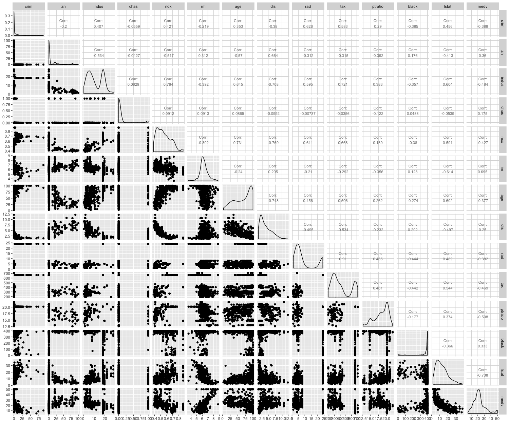
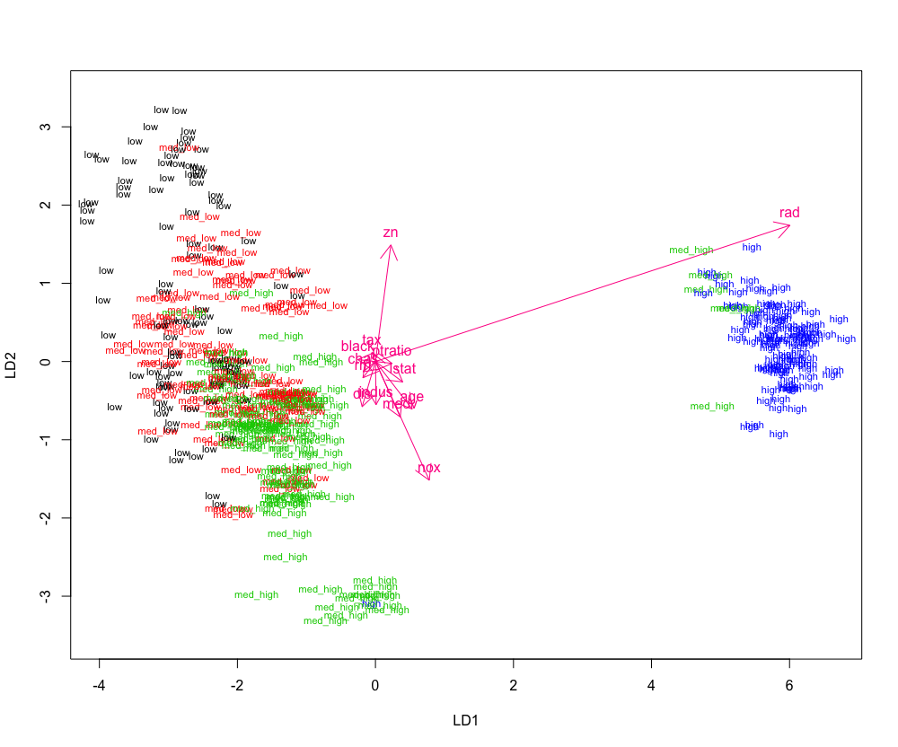
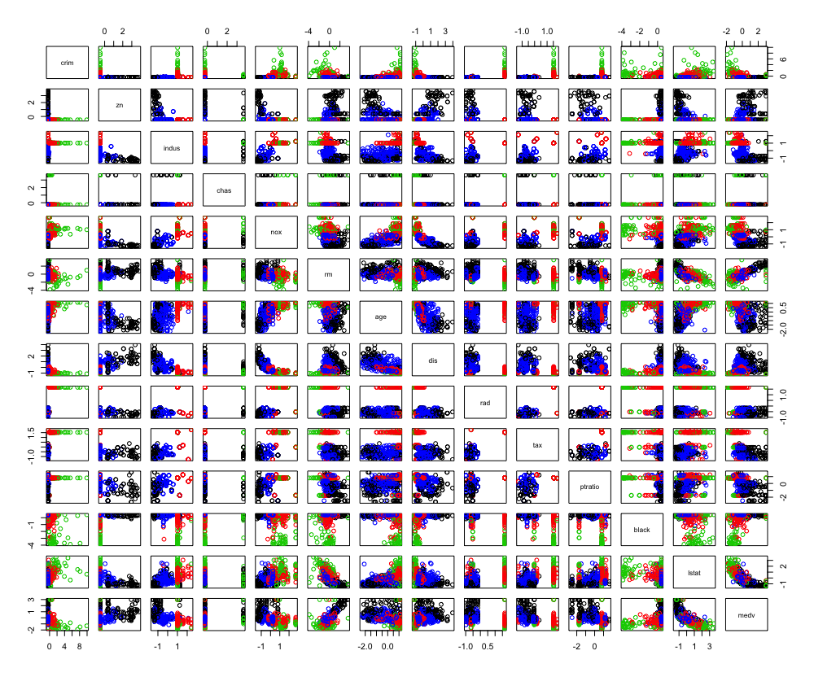
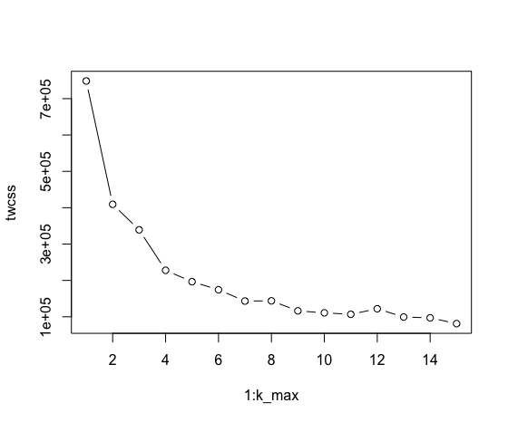
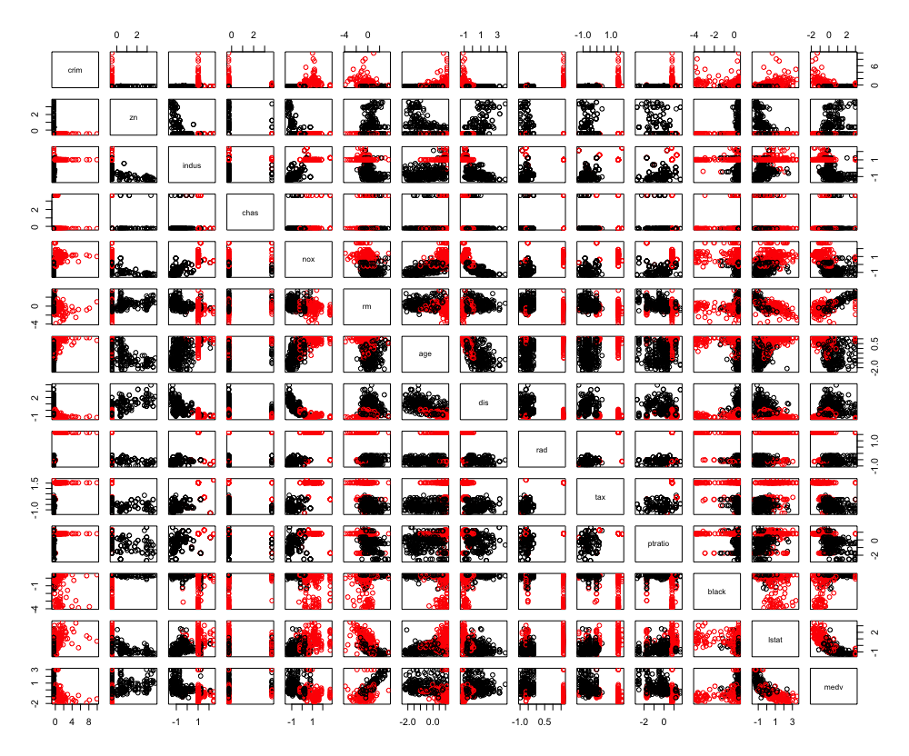

# 4. Classification of the Boston Dataset


## 4.1 Overview

```R
# access the MASS package
library(MASS)

# load the data
data("Boston")

glimpse(Boston)
```


```
Observations: 506
Variables: 14
$ crim    <dbl> 0.00632, 0.02731, 0.02729, 0.03237, 0.06905, 0.02985, 0.08829, 0.14455, 0.21124, 0.17004, 0.…
$ zn      <dbl> 18.0, 0.0, 0.0, 0.0, 0.0, 0.0, 12.5, 12.5, 12.5, 12.5, 12.5, 12.5, 12.5, 0.0, 0.0, 0.0, 0.0,…
$ indus   <dbl> 2.31, 7.07, 7.07, 2.18, 2.18, 2.18, 7.87, 7.87, 7.87, 7.87, 7.87, 7.87, 7.87, 8.14, 8.14, 8.…
$ chas    <int> 0, 0, 0, 0, 0, 0, 0, 0, 0, 0, 0, 0, 0, 0, 0, 0, 0, 0, 0, 0, 0, 0, 0, 0, 0, 0, 0, 0, 0, 0, 0,…
$ nox     <dbl> 0.538, 0.469, 0.469, 0.458, 0.458, 0.458, 0.524, 0.524, 0.524, 0.524, 0.524, 0.524, 0.524, 0…
$ rm      <dbl> 6.575, 6.421, 7.185, 6.998, 7.147, 6.430, 6.012, 6.172, 5.631, 6.004, 6.377, 6.009, 5.889, 5…
$ age     <dbl> 65.2, 78.9, 61.1, 45.8, 54.2, 58.7, 66.6, 96.1, 100.0, 85.9, 94.3, 82.9, 39.0, 61.8, 84.5, 5…
$ dis     <dbl> 4.0900, 4.9671, 4.9671, 6.0622, 6.0622, 6.0622, 5.5605, 5.9505, 6.0821, 6.5921, 6.3467, 6.22…
$ rad     <int> 1, 2, 2, 3, 3, 3, 5, 5, 5, 5, 5, 5, 5, 4, 4, 4, 4, 4, 4, 4, 4, 4, 4, 4, 4, 4, 4, 4, 4, 4, 4,…
$ tax     <dbl> 296, 242, 242, 222, 222, 222, 311, 311, 311, 311, 311, 311, 311, 307, 307, 307, 307, 307, 30…
$ ptratio <dbl> 15.3, 17.8, 17.8, 18.7, 18.7, 18.7, 15.2, 15.2, 15.2, 15.2, 15.2, 15.2, 15.2, 21.0, 21.0, 21…
$ black   <dbl> 396.90, 396.90, 392.83, 394.63, 396.90, 394.12, 395.60, 396.90, 386.63, 386.71, 392.52, 396.…
$ lstat   <dbl> 4.98, 9.14, 4.03, 2.94, 5.33, 5.21, 12.43, 19.15, 29.93, 17.10, 20.45, 13.27, 15.71, 8.26, 1…
$ medv    <dbl> 24.0, 21.6, 34.7, 33.4, 36.2, 28.7, 22.9, 27.1, 16.5, 18.9, 15.0, 18.9, 21.7, 20.4, 18.2, 19…
```

```R
p <- ggpairs(Boston, mapping = aes(), lower = list(combo = wrap("facethist", bins = 10)), upper = list(continuous = wrap("cor", size=3)))
p
```



```R
summary(Boston)
```

```
     crim                zn             indus            chas              nox               rm       
 Min.   : 0.00632   Min.   :  0.00   Min.   : 0.46   Min.   :0.00000   Min.   :0.3850   Min.   :3.561  
 1st Qu.: 0.08204   1st Qu.:  0.00   1st Qu.: 5.19   1st Qu.:0.00000   1st Qu.:0.4490   1st Qu.:5.886  
 Median : 0.25651   Median :  0.00   Median : 9.69   Median :0.00000   Median :0.5380   Median :6.208  
 Mean   : 3.61352   Mean   : 11.36   Mean   :11.14   Mean   :0.06917   Mean   :0.5547   Mean   :6.285  
 3rd Qu.: 3.67708   3rd Qu.: 12.50   3rd Qu.:18.10   3rd Qu.:0.00000   3rd Qu.:0.6240   3rd Qu.:6.623  
 Max.   :88.97620   Max.   :100.00   Max.   :27.74   Max.   :1.00000   Max.   :0.8710   Max.   :8.780  
      age              dis              rad              tax           ptratio          black       
 Min.   :  2.90   Min.   : 1.130   Min.   : 1.000   Min.   :187.0   Min.   :12.60   Min.   :  0.32  
 1st Qu.: 45.02   1st Qu.: 2.100   1st Qu.: 4.000   1st Qu.:279.0   1st Qu.:17.40   1st Qu.:375.38  
 Median : 77.50   Median : 3.207   Median : 5.000   Median :330.0   Median :19.05   Median :391.44  
 Mean   : 68.57   Mean   : 3.795   Mean   : 9.549   Mean   :408.2   Mean   :18.46   Mean   :356.67  
 3rd Qu.: 94.08   3rd Qu.: 5.188   3rd Qu.:24.000   3rd Qu.:666.0   3rd Qu.:20.20   3rd Qu.:396.23  
 Max.   :100.00   Max.   :12.127   Max.   :24.000   Max.   :711.0   Max.   :22.00   Max.   :396.90  
     lstat            medv      
 Min.   : 1.73   Min.   : 5.00  
 1st Qu.: 6.95   1st Qu.:17.02  
 Median :11.36   Median :21.20  
 Mean   :12.65   Mean   :22.53  
 3rd Qu.:16.95   3rd Qu.:25.00  
 Max.   :37.97   Max.   :50.00  
```


## 4.2 Standardising and Categorising
The dataset must be standardised which means all variables fit to normal distribution so that the mean of every variable is zero. This can be done as follows:

```R
boston_scaled <- as.data.frame(scale(Boston))
summary(boston_scaled)
```

```
     crim                 zn               indus              chas              nox         
 Min.   :-0.419367   Min.   :-0.48724   Min.   :-1.5563   Min.   :-0.2723   Min.   :-1.4644  
 1st Qu.:-0.410563   1st Qu.:-0.48724   1st Qu.:-0.8668   1st Qu.:-0.2723   1st Qu.:-0.9121  
 Median :-0.390280   Median :-0.48724   Median :-0.2109   Median :-0.2723   Median :-0.1441  
 Mean   : 0.000000   Mean   : 0.00000   Mean   : 0.0000   Mean   : 0.0000   Mean   : 0.0000  
 3rd Qu.: 0.007389   3rd Qu.: 0.04872   3rd Qu.: 1.0150   3rd Qu.:-0.2723   3rd Qu.: 0.5981  
 Max.   : 9.924110   Max.   : 3.80047   Max.   : 2.4202   Max.   : 3.6648   Max.   : 2.7296  
       rm               age               dis               rad               tax             ptratio       
 Min.   :-3.8764   Min.   :-2.3331   Min.   :-1.2658   Min.   :-0.9819   Min.   :-1.3127   Min.   :-2.7047  
 1st Qu.:-0.5681   1st Qu.:-0.8366   1st Qu.:-0.8049   1st Qu.:-0.6373   1st Qu.:-0.7668   1st Qu.:-0.4876  
 Median :-0.1084   Median : 0.3171   Median :-0.2790   Median :-0.5225   Median :-0.4642   Median : 0.2746  
 Mean   : 0.0000   Mean   : 0.0000   Mean   : 0.0000   Mean   : 0.0000   Mean   : 0.0000   Mean   : 0.0000  
 3rd Qu.: 0.4823   3rd Qu.: 0.9059   3rd Qu.: 0.6617   3rd Qu.: 1.6596   3rd Qu.: 1.5294   3rd Qu.: 0.8058  
 Max.   : 3.5515   Max.   : 1.1164   Max.   : 3.9566   Max.   : 1.6596   Max.   : 1.7964   Max.   : 1.6372  
     black             lstat              medv        
 Min.   :-3.9033   Min.   :-1.5296   Min.   :-1.9063  
 1st Qu.: 0.2049   1st Qu.:-0.7986   1st Qu.:-0.5989  
 Median : 0.3808   Median :-0.1811   Median :-0.1449  
 Mean   : 0.0000   Mean   : 0.0000   Mean   : 0.0000  
 3rd Qu.: 0.4332   3rd Qu.: 0.6024   3rd Qu.: 0.2683  
 Max.   : 0.4406   Max.   : 3.5453   Max.   : 2.9865  
 ```


We also need to categorise our target variable – crim – to classify it:

```R
# Create a quantile vector of crim, and use it to create the categorical "crime".
bins <- quantile(boston_scaled$crim)
crime <- cut(boston_scaled$crim, breaks = bins, include.lowest = TRUE, label = c('low','med_low','med_high','high'))
# Replace the original unscaled variable.
boston_scaled <- dplyr::select(boston_scaled, -crim)
boston_scaled <- data.frame(boston_scaled, crime)
table(boston_scaled$crim) # Explore the categorised variable.
```


```
##      low  med_low med_high     high 
##      127      126      126      127
```


In order to create the LDA model and to test it, the data has to be divided into training and testing sets. 

```R
n <- nrow(boston_scaled) # Get number of rows in the dataset.
ind <- sample(n,  size = n * 0.8) # Choose randomly 80% of the rows.
train <- boston_scaled[ind,] # Create train set.
test <- boston_scaled[-ind,] # Create test set.
# Save the correct classes from the test data.
correct_classes <- test$crime
# Remove the crime variable from the test data.
test <- dplyr::select(test, -crime)
```


## 4.3 Fitting the Model

```R
lda.fit <- lda(crime ~ ., data = train)
lda.fit
```

```
Call:
lda(crime ~ ., data = train)

Prior probabilities of groups:
      low   med_low  med_high      high 
0.2475248 0.2549505 0.2500000 0.2475248 

Group means:
                 zn       indus         chas        nox         rm        age        dis        rad        tax
low       0.8788254 -0.90299708 -0.193587063 -0.8578620  0.4283921 -0.8810268  0.8563773 -0.6993483 -0.7586291
med_low  -0.1000971 -0.32495455 -0.004759149 -0.5695319 -0.1409065 -0.3721597  0.3648300 -0.5470148 -0.4791331
med_high -0.3751653  0.09765591  0.234426408  0.3247534  0.1474674  0.3919174 -0.3256314 -0.3974038 -0.3377904
high     -0.4872402  1.01715195 -0.075474056  1.0130937 -0.3741645  0.7948136 -0.8597796  1.6377820  1.5138081
             ptratio       black       lstat         medv
low      -0.42566133  0.38009442 -0.75226396  0.528774452
med_low  -0.09874892  0.31131227 -0.12813291  0.003927945
med_high -0.28221456  0.09962635 -0.03927833  0.188486538
high      0.78037363 -0.77500232  0.89169331 -0.705092197

Coefficients of linear discriminants:
                LD1         LD2         LD3
zn       0.15327760  0.72696090 -0.96918821
indus    0.06895212 -0.23203144  0.19852525
chas    -0.08674273 -0.16587825  0.09866070
nox      0.29905137 -0.69375411 -1.34777143
rm      -0.08073322 -0.13239391 -0.18618294
age      0.35186877 -0.34166351 -0.30960892
dis     -0.04116222 -0.25001198  0.05134464
rad      3.22140261  0.98659875 -0.38833796
tax     -0.01928876 -0.13190509  0.89928951
ptratio  0.11143195  0.02470684 -0.30292304
black   -0.12568460  0.01433414  0.08414446
lstat    0.21707935 -0.13116253  0.54061068
medv     0.17787842 -0.28268695 -0.07678544

Proportion of trace:
   LD1    LD2    LD3 
0.9527 0.0337 0.0136
```
The output shows that we have three linear discriminants. The first explains vast majority – 95.27% – of the between-group variance.


```R
# Define a function for the biplot arrows.
lda.arrows <- function(x, myscale = 2, arrow_heads = 0.2, color = "deeppink", tex = 1, choices = c(1,2)){
  heads <- coef(x)
  arrows(x0 = 0, y0 = 0, 
         x1 = myscale * heads[,choices[1]], 
         y1 = myscale * heads[,choices[2]], col=color, length = arrow_heads)
  text(myscale * heads[,choices], labels = row.names(heads), 
       cex = tex, col=color, pos=3)
}
classes <- as.numeric(train$crime) # Turn the classes to numeric for plotting.
plot(lda.fit, dimen = 2, col = classes, pch = classes) # Plot.
lda.arrows(lda.fit) # Add arrows.
```



## 4.4 Predicting

```R
lda.pred <- predict(lda.fit, newdata = test) # Predict the test values.
# Cross tabulate the predictions with the correct values.
table(correct = correct_classes, predicted = lda.pred$class)
```

```
          predicted
correct    low med_low med_high high
  low       15       6        3    0
  med_low    3      18        4    0
  med_high   0      15       15    2
  high       0       0        0   21
```


As seen from the table, the model didn't make good predict for the “med_high” category. Thus, the model can be used to make crude predictions, but it’s hardly perfect.


## 4.5 Clustering


```R
boston_scaled <- as.data.frame(scale(Boston)) # Standardise the data.
dist_eu <- dist(boston_scaled) # Create an euclidian distance matrix.
summary(dist_eu) # Summarise the matrix.
```


```
   Min. 1st Qu.  Median    Mean 3rd Qu.    Max. 
 0.1343  3.4625  4.8241  4.9111  6.1863 14.3970 
```

We can try to cluster the data with k-means straight away. We used four classes for our LDA model, so we might try it with as many clusters instead:

```R
km <-kmeans(dist_eu, centers = 4) # Cluster the data.
pairs(boston_scaled, col = km$cluster) # Plot the clusters.
```




However, while the results look somewhat reasonable, the amount of clusters was merely a guess. To determine it properly, the total within cluster sum of squares (TWCSS) should be calculated. Let’s try it, with a maximum of 15 clusters:


```R
k_max <- 15 # Maximum number of clusters to try.
# Define a function for testing.
k_try <- function(k) {
  kmeans(dist_eu, k)$tot.withinss
}
# Calculate the total within sum of squares using the function.
twcss <- sapply(1:k_max, k_try)

# Visualize the results.
plot(1:k_max, twcss, type='b')
```


For comparison, re-cluster the data with just two clusters:
```R
km <-kmeans(dist_eu, centers = 2) # Cluster the data.
pairs(boston_scaled, col = km$cluster) # Plot the clusters.
```




It can be seen from the plot there is lees overlap compared to that of four clusters, which means the optimal clusters is two.


