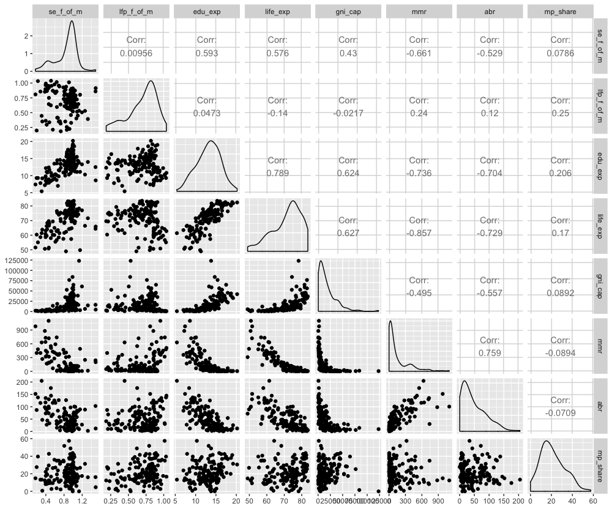
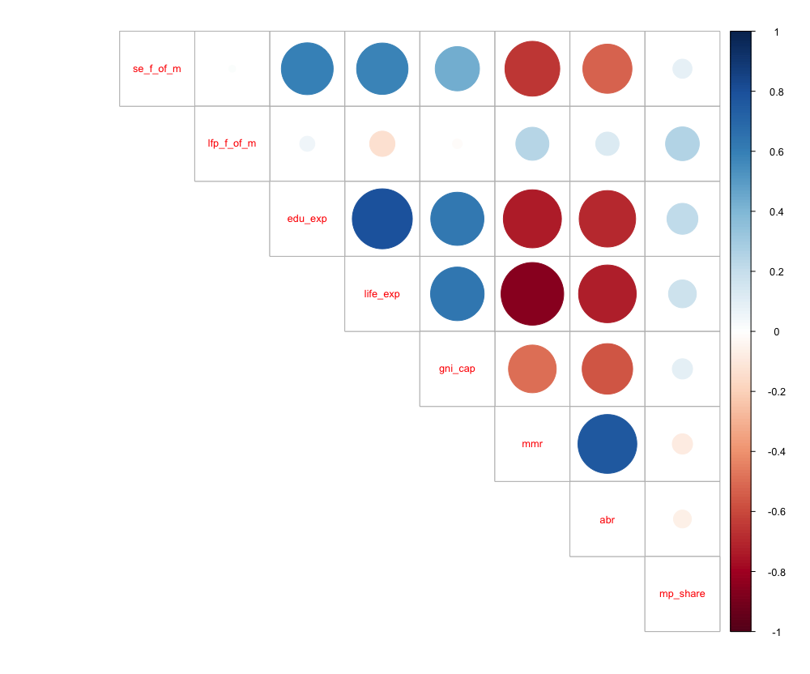
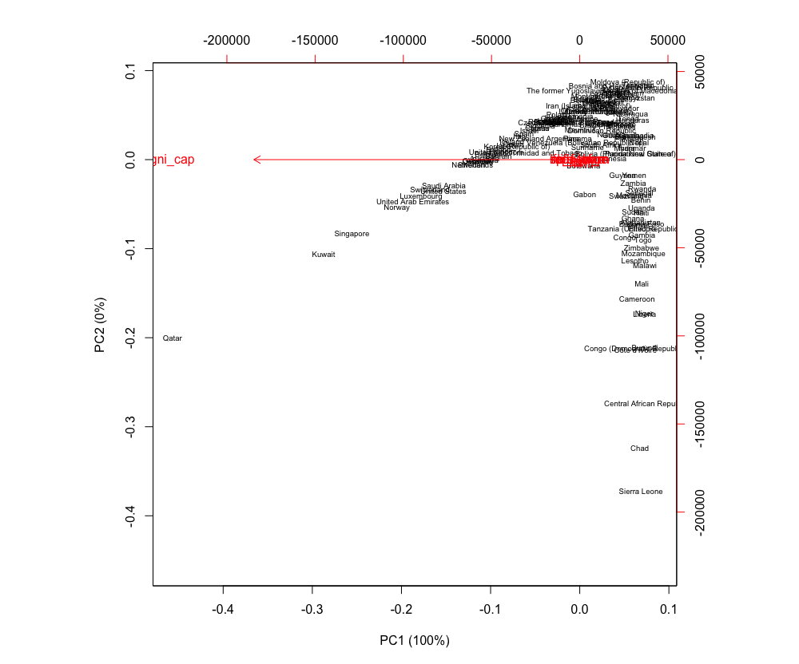
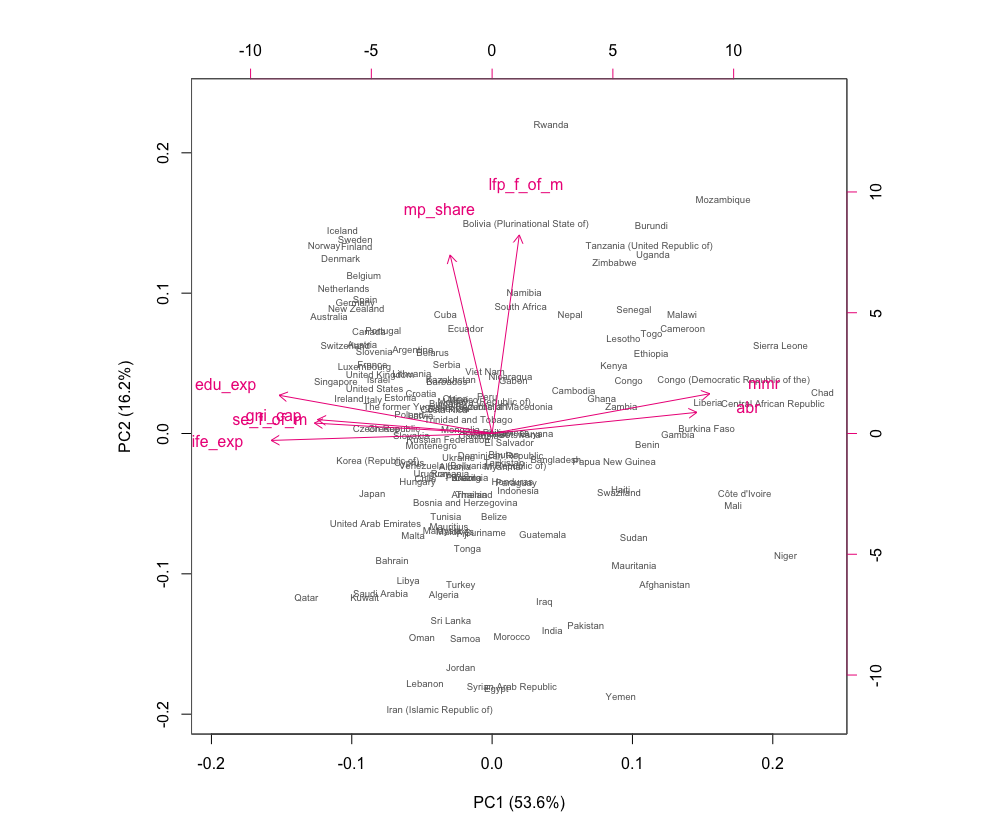
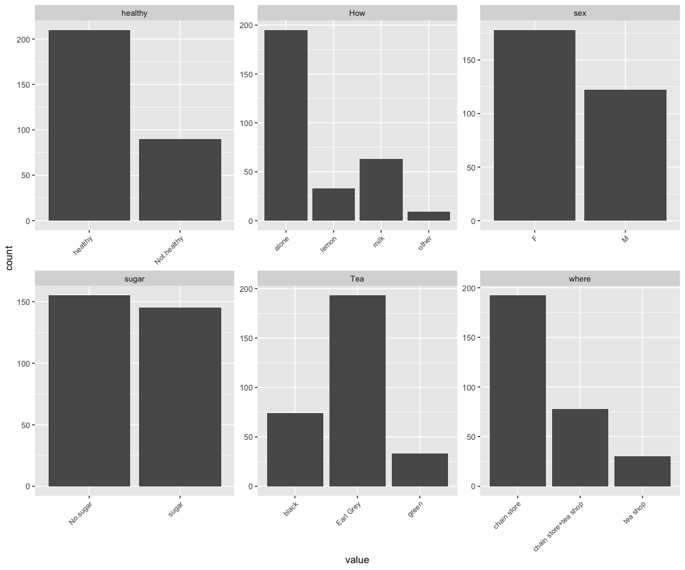
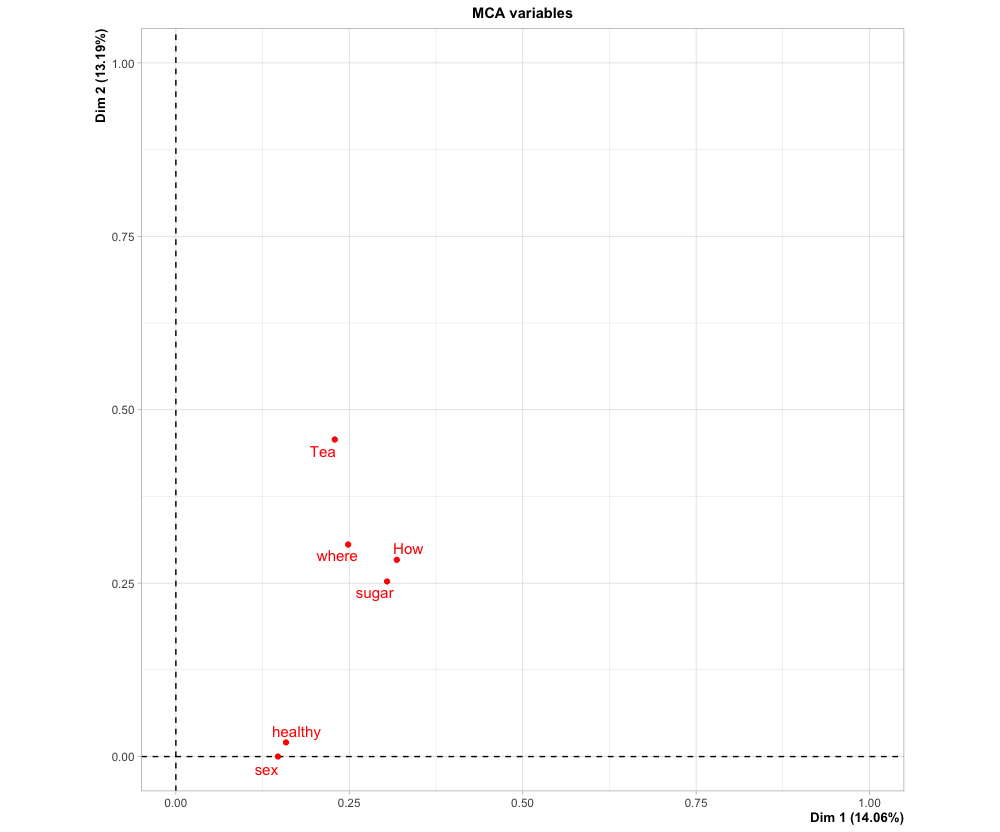
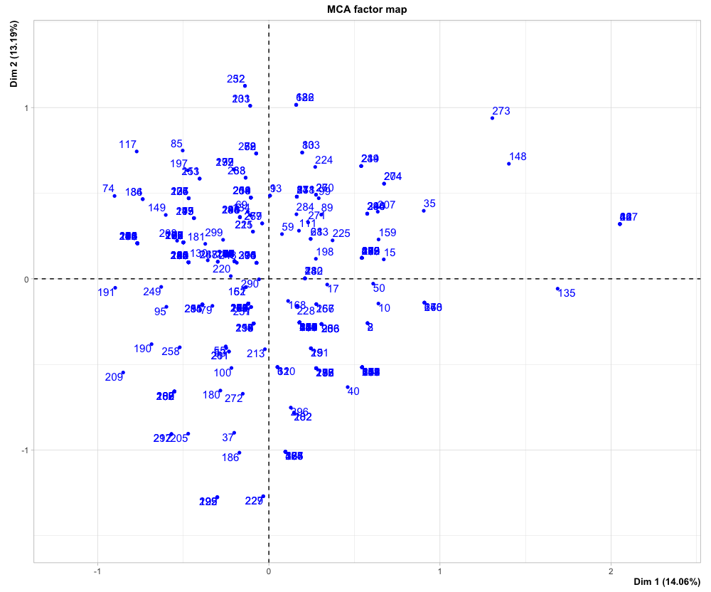
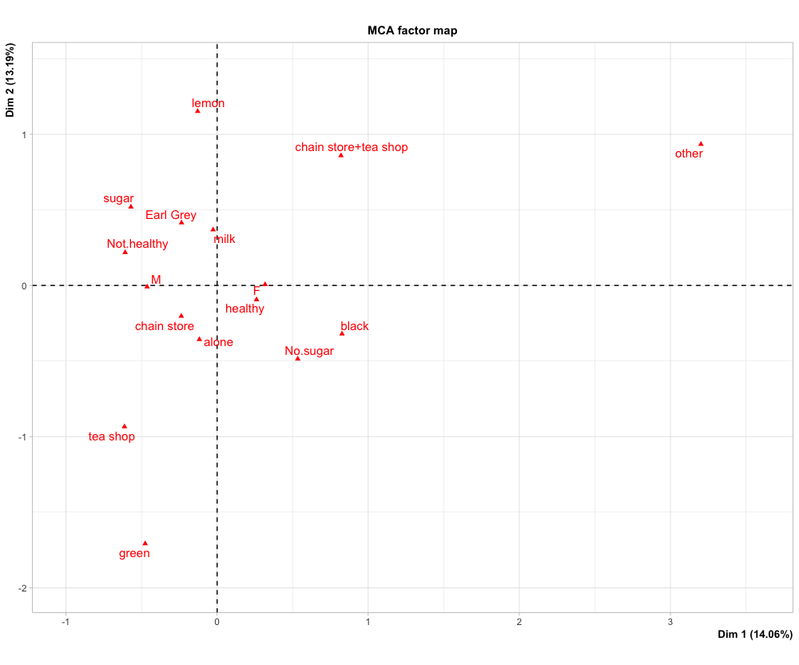

# 5. Tea and Human Development

## 5.1 Data overview
```R
# Read in the data
human <- as.data.frame(read.table('data/human.csv',  sep="\t", header=TRUE))
glimpse(human)
```

```
Observations: 155
Variables: 8
$ se_f_of_m  <dbl> 1.0072389, 0.9968288, 0.9834369, 0.9886128, 0.9690608, 0.9927835, 1.0241730, 1.0031646, 1…
$ lfp_f_of_m <dbl> 0.8908297, 0.8189415, 0.8251001, 0.8840361, 0.8286119, 0.8072289, 0.7797357, 0.8171263, 0…
$ edu_exp    <dbl> 17.5, 20.2, 15.8, 18.7, 17.9, 16.5, 18.6, 16.5, 15.9, 19.2, 15.4, 15.8, 16.2, 19.0, 16.9,…
$ life_exp   <dbl> 81.6, 82.4, 83.0, 80.2, 81.6, 80.9, 80.9, 79.1, 82.0, 81.8, 83.0, 82.2, 80.7, 82.6, 81.9,…
$ gni_cap    <dbl> 64992, 42261, 56431, 44025, 45435, 43919, 39568, 52947, 42155, 32689, 76628, 45636, 39267…
$ mmr        <int> 4, 6, 6, 5, 6, 7, 9, 28, 11, 8, 6, 4, 8, 4, 27, 2, 11, 6, 6, 12, 4, 4, 7, 4, 4, 5, 5, 11,…
$ abr        <dbl> 7.8, 12.1, 1.9, 5.1, 6.2, 3.8, 8.2, 31.0, 14.5, 25.3, 6.0, 6.5, 25.8, 11.5, 2.2, 7.8, 8.3…
$ mp_share   <dbl> 39.6, 30.5, 28.5, 38.0, 36.9, 36.9, 19.9, 19.4, 28.2, 31.4, 25.3, 43.6, 23.5, 41.3, 16.3,…
```


From the output, there are 155 observations (countries) and 8 variables, the description is shown below:

- se_f_of_m = ratio of Female and Male populations with secondary education in each country (i.e. edu2F / edu2M).
- lfp_f_of_m =  ratio of labour force participation of females and males in each country (i.e. labF / labM).
- edu_exp = expected years of education
- life_exp = life expectancy
- gni_cap = gross national income (GNI) per capita (dollars, purchasing power parity)
- mmr = maternal mortality rate
- abr = adolescent birth rate
- mp_share = share of female representatives in the national parliament


```R
ggpairs(human)
```




```R
summary(human)
```

```
  se_f_of_m        lfp_f_of_m        edu_exp         life_exp        gni_cap            mmr        
 Min.   :0.1717   Min.   :0.1857   Min.   : 5.40   Min.   :49.00   Min.   :   581   Min.   :   1.0  
 1st Qu.:0.7264   1st Qu.:0.5984   1st Qu.:11.25   1st Qu.:66.30   1st Qu.:  4198   1st Qu.:  11.5  
 Median :0.9375   Median :0.7535   Median :13.50   Median :74.20   Median : 12040   Median :  49.0  
 Mean   :0.8529   Mean   :0.7074   Mean   :13.18   Mean   :71.65   Mean   : 17628   Mean   : 149.1  
 3rd Qu.:0.9968   3rd Qu.:0.8535   3rd Qu.:15.20   3rd Qu.:77.25   3rd Qu.: 24512   3rd Qu.: 190.0  
 Max.   :1.4967   Max.   :1.0380   Max.   :20.20   Max.   :83.50   Max.   :123124   Max.   :1100.0  
      abr            mp_share    
 Min.   :  0.60   Min.   : 0.00  
 1st Qu.: 12.65   1st Qu.:12.40  
 Median : 33.60   Median :19.30  
 Mean   : 47.16   Mean   :20.91  
 3rd Qu.: 71.95   3rd Qu.:27.95  
 Max.   :204.80   Max.   :57.50  
 ```
```R 
corrplot(round(cor(human), digits = 2), method = "circle", type = "upper", tl.pos = "d", tl.cex = 0.8)
```



The plot shows strongest correlation of all is the strong negative correlation between life expectancy (life_exp) and maternal mortality rate (mmr). The next strongest correlations are the positive correlations between life expectancy (life_exp) and education expectancy (edu_exp) and maternal mortality rate (mmr) and adolescent birth rate (abr).


## 5.2 PCA
```R
pca_human <- prcomp(human)
s_human_nonstd <- summary(pca_human)
s_human_nonstd
```
```
Importance of components:
                             PC1      PC2   PC3   PC4   PC5   PC6    PC7    PC8
Standard deviation     1.854e+04 185.5219 25.19 11.45 3.766 1.566 0.1912 0.1591
Proportion of Variance 9.999e-01   0.0001  0.00  0.00 0.000 0.000 0.0000 0.0000
Cumulative Proportion  9.999e-01   1.0000  1.00  1.00 1.000 1.000 1.0000 1.0000
```

```R
# Percentages of variance for the plot titles.
pr_shns <- round(100*s_human_nonstd$importance[2, ], digits = 1)
pc_shns_lab <- paste0(names(pr_shns), " (", pr_shns, "%)")
biplot(pca_human, choices = 1:2, cex = c(0.6, 1), col = c("grey40", "deeppink2"), xlab = pc_shns_lab[1], ylab = pc_shns_lab[2])
```



```R
human_std <- scale(human) # Standardise the variables.
pca_human_std <- prcomp(human_std)
s_human_std <- summary(pca_human_std)
s_human_std
```
```R
pr_shs <- round(100*s_human_std$importance[2, ], digits = 1)
pc_shs_lab <- paste0(names(pr_shs), " (", pr_shs, "%)")
biplot(pca_human_std, choices = 1:2, cex = c(0.6, 1), col = c("grey40", "deeppink2"), xlab = pc_shs_lab[1], ylab = pc_shs_lab[2])
```


## 5.3 Interpreting the PCA Results

The 1st principal component (PC1) explains 53.6% of the total variance of the original 8 variables, and the 2nd principal component (PC2) explains 16.2% of total variance of the original 8 variables.

From the plot, we can conclude that the PC1 represents variables related mostly to poverty&health and the PC2  related mostly to gender equality.

Its safe to say that total variance in the data coms from poverty and health, but gender equality also explains some of it.


From the arrows, we can see that high maternal mortality rate (mmr) and adolescent birth rate (abr) correlate strongly with poverty and that high life expectancy (life_exp), high educational expectancy (edu_exp), high ratio of females with secondary education (se_f_of_m) and high GNI (gni_cap) have a strong negative correlation with it. 

Further, we can see that high ratio of female MPs  (mp_share) and high ratio of female participation in the labour force (lfp_f_of_m) have strong positive correlation with gender equality.


## 5.4 Tea data analysis
```R
data("tea")
glimpse(tea)
```

```
Observations: 300
Variables: 36
$ breakfast        <fct> breakfast, breakfast, Not.breakfast, Not.breakfast, breakfast, Not.breakfast, break…
$ tea.time         <fct> Not.tea time, Not.tea time, tea time, Not.tea time, Not.tea time, Not.tea time, tea…
$ evening          <fct> Not.evening, Not.evening, evening, Not.evening, evening, Not.evening, Not.evening, …
$ lunch            <fct> Not.lunch, Not.lunch, Not.lunch, Not.lunch, Not.lunch, Not.lunch, Not.lunch, Not.lu…
$ dinner           <fct> Not.dinner, Not.dinner, dinner, dinner, Not.dinner, dinner, Not.dinner, Not.dinner,…
$ always           <fct> Not.always, Not.always, Not.always, Not.always, always, Not.always, Not.always, Not…
$ home             <fct> home, home, home, home, home, home, home, home, home, home, home, home, home, home,…
$ work             <fct> Not.work, Not.work, work, Not.work, Not.work, Not.work, Not.work, Not.work, Not.wor…
$ tearoom          <fct> Not.tearoom, Not.tearoom, Not.tearoom, Not.tearoom, Not.tearoom, Not.tearoom, Not.t…
$ friends          <fct> Not.friends, Not.friends, friends, Not.friends, Not.friends, Not.friends, friends, …
$ resto            <fct> Not.resto, Not.resto, resto, Not.resto, Not.resto, Not.resto, Not.resto, Not.resto,…
$ pub              <fct> Not.pub, Not.pub, Not.pub, Not.pub, Not.pub, Not.pub, Not.pub, Not.pub, Not.pub, No…
$ Tea              <fct> black, black, Earl Grey, Earl Grey, Earl Grey, Earl Grey, Earl Grey, black, Earl Gr…
$ How              <fct> alone, milk, alone, alone, alone, alone, alone, milk, milk, alone, alone, alone, mi…
$ sugar            <fct> sugar, No.sugar, No.sugar, sugar, No.sugar, No.sugar, No.sugar, No.sugar, No.sugar,…
$ how              <fct> tea bag, tea bag, tea bag, tea bag, tea bag, tea bag, tea bag, tea bag, tea bag+unp…
$ where            <fct> chain store, chain store, chain store, chain store, chain store, chain store, chain…
$ price            <fct> p_unknown, p_variable, p_variable, p_variable, p_variable, p_private label, p_varia…
$ age              <int> 39, 45, 47, 23, 48, 21, 37, 36, 40, 37, 32, 31, 56, 66, 65, 60, 35, 72, 73, 80, 76,…
$ sex              <fct> M, F, F, M, M, M, M, F, M, M, M, M, M, M, M, M, M, F, F, F, F, F, F, F, F, F, F, F,…
$ SPC              <fct> middle, middle, other worker, student, employee, student, senior, middle, senior, s…
$ Sport            <fct> sportsman, sportsman, sportsman, Not.sportsman, sportsman, sportsman, sportsman, sp…
$ age_Q            <fct> 35-44, 45-59, 45-59, 15-24, 45-59, 15-24, 35-44, 35-44, 35-44, 35-44, 25-34, 25-34,…
$ frequency        <fct> 1/day, 1/day, +2/day, 1/day, +2/day, 1/day, 3 to 6/week, 1 to 2/week, +2/day, +2/da…
$ escape.exoticism <fct> Not.escape-exoticism, escape-exoticism, Not.escape-exoticism, escape-exoticism, esc…
$ spirituality     <fct> Not.spirituality, Not.spirituality, Not.spirituality, spirituality, spirituality, N…
$ healthy          <fct> healthy, healthy, healthy, healthy, Not.healthy, healthy, healthy, healthy, Not.hea…
$ diuretic         <fct> Not.diuretic, diuretic, diuretic, Not.diuretic, diuretic, Not.diuretic, Not.diureti…
$ friendliness     <fct> Not.friendliness, Not.friendliness, friendliness, Not.friendliness, friendliness, N…
$ iron.absorption  <fct> Not.iron absorption, Not.iron absorption, Not.iron absorption, Not.iron absorption,…
$ feminine         <fct> Not.feminine, Not.feminine, Not.feminine, Not.feminine, Not.feminine, Not.feminine,…
$ sophisticated    <fct> Not.sophisticated, Not.sophisticated, Not.sophisticated, sophisticated, Not.sophist…
$ slimming         <fct> No.slimming, No.slimming, No.slimming, No.slimming, No.slimming, No.slimming, No.sl…
$ exciting         <fct> No.exciting, exciting, No.exciting, No.exciting, No.exciting, No.exciting, No.excit…
$ relaxing         <fct> No.relaxing, No.relaxing, relaxing, relaxing, relaxing, relaxing, relaxing, relaxin…
$ effect.on.health <fct> No.effect on health, No.effect on health, No.effect on health, No.effect on health,…
```


```R
cha <- dplyr::select(tea, one_of(c('Tea','How','sugar','where','healthy','sex')))
glimpse(cha)
```


```
Observations: 300
Variables: 6
$ Tea     <fct> black, black, Earl Grey, Earl Grey, Earl Grey, Earl Grey, Earl Grey, black, Earl Grey, black…
$ How     <fct> alone, milk, alone, alone, alone, alone, alone, milk, milk, alone, alone, alone, milk, milk,…
$ sugar   <fct> sugar, No.sugar, No.sugar, sugar, No.sugar, No.sugar, No.sugar, No.sugar, No.sugar, No.sugar…
$ where   <fct> chain store, chain store, chain store, chain store, chain store, chain store, chain store, c…
$ healthy <fct> healthy, healthy, healthy, healthy, Not.healthy, healthy, healthy, healthy, Not.healthy, hea…
$ sex     <fct> M, F, F, M, M, M, M, F, M, M, M, M, M, M, M, M, M, F, F, F, F, F, F, F, F, F, F, F, F, F, F,…
```


```R
ggplot(gather(cha), aes(value)) + facet_wrap("key", scales = "free") + geom_bar() + theme(axis.text.x = element_text(angle = 45, hjust = 1, size = 8))
```




```R
cha_mca <- MCA(cha, graph = FALSE)
summary(cha_mca)
```


```

Call:
MCA(X = cha, graph = FALSE) 


Eigenvalues
                       Dim.1   Dim.2   Dim.3   Dim.4   Dim.5   Dim.6   Dim.7   Dim.8   Dim.9  Dim.10
Variance               0.234   0.220   0.212   0.193   0.169   0.159   0.139   0.124   0.119   0.096
% of var.             14.063  13.193  12.749  11.603  10.119   9.545   8.356   7.462   7.141   5.769
Cumulative % of var.  14.063  27.256  40.005  51.608  61.727  71.271  79.627  87.090  94.231 100.000

Individuals (the 10 first)
               Dim.1    ctr   cos2    Dim.2    ctr   cos2    Dim.3    ctr   cos2  
1           | -0.104  0.015  0.009 | -0.165  0.041  0.023 |  0.325  0.165  0.089 |
2           |  0.577  0.473  0.212 | -0.259  0.102  0.043 |  0.047  0.003  0.001 |
3           |  0.180  0.046  0.052 | -0.255  0.099  0.106 | -0.568  0.507  0.523 |
4           | -0.469  0.313  0.286 |  0.097  0.014  0.012 | -0.019  0.001  0.000 |
5           | -0.388  0.215  0.142 | -0.150  0.034  0.021 | -0.257  0.104  0.062 |
6           | -0.089  0.011  0.011 | -0.261  0.103  0.091 | -0.126  0.025  0.021 |
7           | -0.089  0.011  0.011 | -0.261  0.103  0.091 | -0.126  0.025  0.021 |
8           |  0.577  0.473  0.212 | -0.259  0.102  0.043 |  0.047  0.003  0.001 |
9           |  0.007  0.000  0.000 |  0.486  0.357  0.119 |  0.199  0.062  0.020 |
10          |  0.640  0.583  0.266 | -0.145  0.032  0.014 |  0.403  0.255  0.105 |

Categories (the 10 first)
                Dim.1     ctr    cos2  v.test     Dim.2     ctr    cos2  v.test     Dim.3     ctr    cos2
black       |   0.826  11.979   0.224   8.177 |  -0.320   1.919   0.034  -3.170 |   0.608   7.164   0.121
Earl Grey   |  -0.235   2.536   0.100  -5.468 |   0.415   8.395   0.311   9.636 |  -0.342   5.893   0.211
green       |  -0.476   1.774   0.028  -2.895 |  -1.708  24.331   0.361 -10.385 |   0.634   3.469   0.050
alone       |  -0.117   0.638   0.026  -2.768 |  -0.357   6.285   0.237  -8.416 |  -0.364   6.768   0.247
lemon       |  -0.129   0.130   0.002  -0.782 |   1.152  11.064   0.164   7.003 |   1.112  10.662   0.153
milk        |  -0.026   0.010   0.000  -0.235 |   0.369   2.163   0.036   3.286 |   0.386   2.455   0.040
other       |   3.202  21.870   0.317   9.737 |   0.934   1.985   0.027   2.841 |   1.116   2.931   0.039
No.sugar    |   0.534  10.463   0.304   9.541 |  -0.486   9.248   0.252  -8.688 |  -0.142   0.823   0.022
sugar       |  -0.570  11.185   0.304  -9.541 |   0.519   9.885   0.252   8.688 |   0.152   0.879   0.022
chain store |  -0.237   2.562   0.100  -5.470 |  -0.203   2.001   0.073  -4.682 |  -0.335   5.622   0.199
             v.test  
black         6.021 |
Earl Grey    -7.936 |
green         3.855 |
alone        -8.586 |
lemon         6.758 |
milk          3.442 |
other         3.394 |
No.sugar     -2.547 |
sugar         2.547 |
chain store  -7.715 |

Categorical variables (eta2)
              Dim.1 Dim.2 Dim.3  
Tea         | 0.229 0.457 0.211 |
How         | 0.318 0.284 0.291 |
sugar       | 0.304 0.252 0.022 |
where       | 0.248 0.306 0.362 |
healthy     | 0.159 0.020 0.028 |
sex         | 0.147 0.000 0.362 |
```


Drawing a variable biplot of the analysis:
```R

par(mfrow = c(1,3)) # Set some graphical params.
plot(cha_mca, choix = "var", title = "MCA variables") # The variable biplot.
plot(cha_mca, choix = "ind", invisible = "var") # The individuals plot.
plot(cha_mca, choix = "ind", invisible = "ind") # The categories plot.
```





As can be seen from the leftmost plot, the strongest link is the tea variable’s – i.e. types of tea – link to the second dimension.

The plots on the center and on the right shows no clear pattern in either of them.

